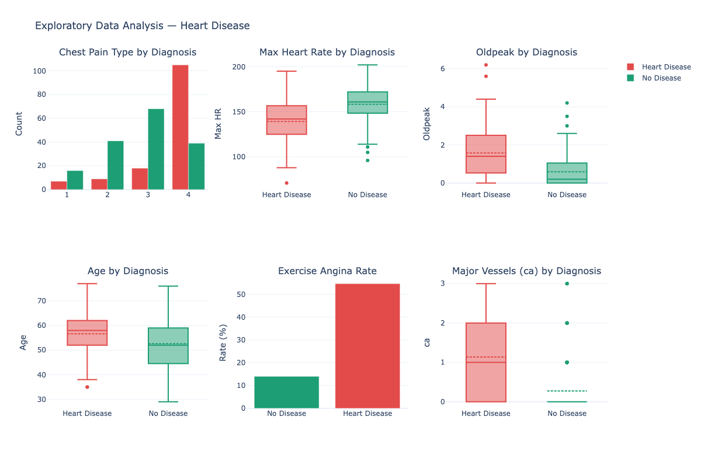
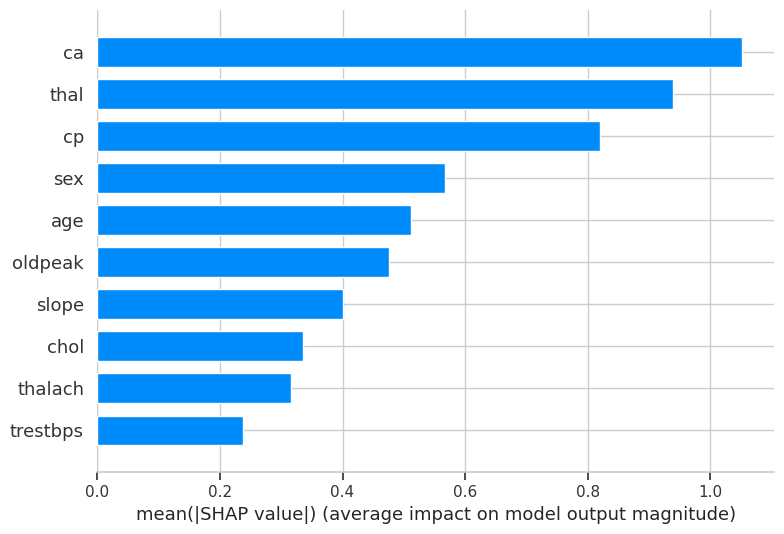
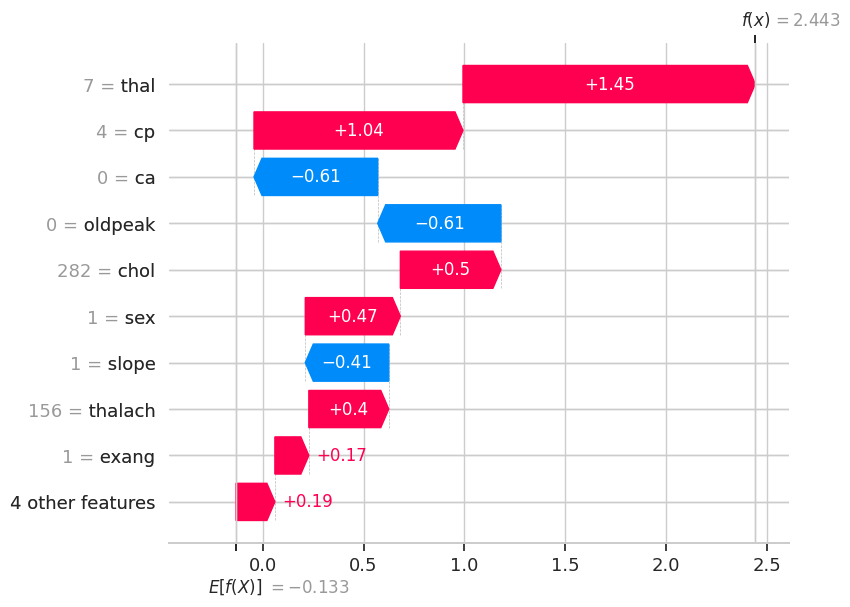

# Heart Disease Prediction + SHAP Explainability

A supervised ML project that predicts heart disease risk from routine clinical
measurements — and explains every prediction at the individual patient level using SHAP.

---

## The Problem

Heart disease is diagnosed through invasive procedures. The question this project
addresses: can we flag high-risk patients from non-invasive clinical data collected
during a standard checkup, before any further testing is ordered?

---

## Dataset

**Source:** UCI Heart Disease Dataset (Cleveland, ID=45)  
**Records:** 303 patients, 13 clinical features  
**Target:** Disease / No Disease (binary, derived from original 0–4 scale)

| Feature | Description |
|---|---|
| age | Patient age in years |
| sex | 1 = male, 0 = female |
| cp | Chest pain type (1–4) |
| trestbps | Resting blood pressure (mm Hg) |
| chol | Serum cholesterol (mg/dL) |
| thalach | Maximum heart rate achieved |
| oldpeak | ST depression induced by exercise |
| ca | Number of major vessels colored by fluoroscopy |
| thal | Thalassemia type |

**Class balance:** 54.1% No Disease — 45.9% Disease. Near-balanced, no oversampling needed.

---

## Results

| Model | Accuracy | Precision | Recall | F1 | ROC-AUC |
|---|---|---|---|---|---|
| Logistic Regression | 0.8689 | 0.8125 | 0.9286 | 0.8667 | **0.9513** |
| Random Forest | **0.9016** | **0.8667** | 0.9286 | **0.8966** | 0.9470 |
| XGBoost | 0.8852 | 0.8182 | **0.9643** | 0.8852 | 0.9416 |

**Best model by ROC-AUC: Logistic Regression (0.9513)**

**Confusion matrix (Logistic Regression):**

| | Predicted No Disease | Predicted Disease |
|---|---|---|
| Actual No Disease | 27 (TN) | 6 (FP) |
| Actual Disease | 2 (FN) | 26 (TP) |

Only 2 missed disease cases out of 28 real patients — Recall = 92.86%.

---

## Why Recall Is the Priority Metric

A False Negative here means a patient with heart disease leaves the clinic
undiagnosed. That is a materially worse outcome than a False Positive
(healthy patient flagged for follow-up). Recall is therefore the primary
clinical metric, with ROC-AUC used for overall model selection.

---

## Key Clinical Findings from EDA

**Oldpeak separates groups cleanly:**
Heart disease patients average 1.57 vs 0.59 for healthy patients.
ST depression during exercise stress testing is an established clinical marker.

**Maximum heart rate (thalach) is inversely related to disease:**
Disease patients average 139.26 bpm vs 158.38 for healthy patients.
Lower exercise capacity is associated with reduced cardiac function.

**Age difference is smaller than expected:**
Disease: 56.63 years average vs 52.59 for healthy patients.
A 4-year gap — age alone is not a reliable predictor in this dataset.



---

## SHAP Explainability

SHAP TreeExplainer was applied to decompose each prediction into
individual feature contributions.

**Global feature importance:**



**Single patient explanation:**

One patient predicted at 92% disease probability:

```
age=35, cp=4 (atypical angina), trestbps=126, chol=282
thalach=185, oldpeak=0, ca=0, thal=3
```

The SHAP waterfall plot shows exactly which values pushed the
prediction toward disease and which pulled it toward healthy.



---

## Cross-Validation

```
Logistic Regression    0.801 +/- 0.026
Random Forest          0.780 +/- 0.028
XGBoost                varies by run
```

The Logistic Regression stability (±0.026) confirms its ROC-AUC lead
is not an artifact of one favorable split.

---

## How to Run

```bash
pip install ucimlrepo shap xgboost scikit-learn pandas plotly kaleido
jupyter notebook Heart_Disease_Prediction.ipynb
```

Dataset downloads automatically via `ucimlrepo`.

---

## Where to Place Screenshots

```
heart-disease-prediction/
    images/
        eda_dashboard.png        Section 4 — EDA subplots
        model_comparison.png     Section 8 — model bar chart + ROC curves
        confusion_matrix.png     Section 9 — confusion matrix heatmap
        shap_summary.png         Section 10 — SHAP beeswarm
        shap_waterfall.png       Section 11 — single patient waterfall
        executive_dashboard.png  Section 13 — full dashboard
    README.md
    Heart_Disease_Prediction.ipynb
```

---

## Project Structure

```
Heart_Disease_Prediction.ipynb    main notebook (13 sections)
README.md                         this file
images/                           screenshots from notebook output
```

---

* Hasan Akhras*
